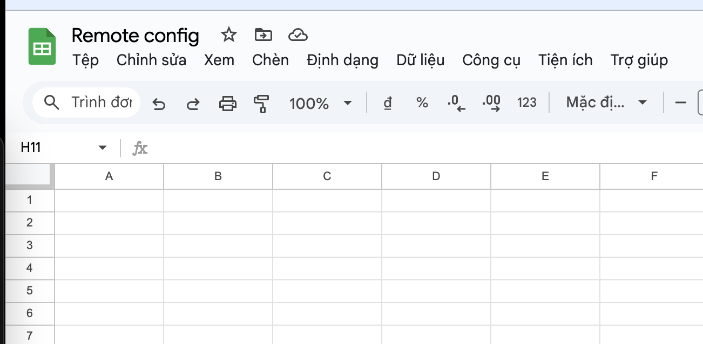
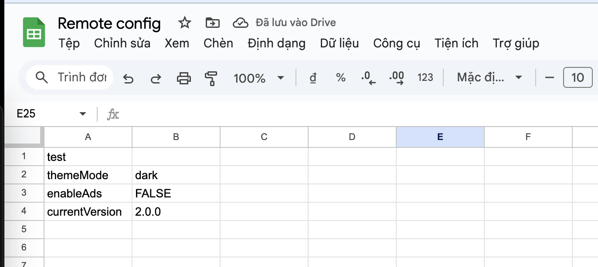
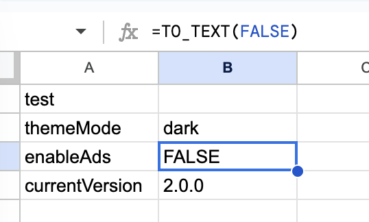
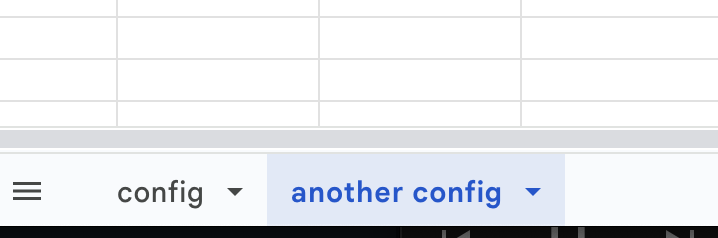

# Dart Google Sheet Remote Config

[](https://pub.dev/packages/dart_gsheet_remote_config)

This is a package that allows you to use Google Sheets as a remote config for changing your Dart/Flutter app's behaviors, settings,.. without updating. It is inspired by @theapache64's [blog](https://theapache64.github.io/posts/google-sheet-as-remote-config-for-microcontrollers/).

## How it works

- This package uses [Query Visualization API](https://developers.google.com/chart/interactive/docs/querylanguage) and some tricks to get data from Google Sheet.

## MUST READ before use

- If you have some configs (API key, token,...) related to security, please **DO NOT** use this package, because it is **PUBLIC** and **NOT SECURE**.

## Setup

### Google Sheet

- Create a Google Sheet document, make it **PUBLIC** (If not you will get 401, in the future I will find the way to inject auth token for private sheeet) and put an easy to remember document name.



- Add your data to sheet in format:
  - First column will be keys
  - Second column will be values



- **MUST READ**: Every values in sheet is marked as **String**. For **int**, **doube**, **bool**, we should convert it to **String**, use `TO_TEXT` fomular to convert value to **String** type:



- You can create more than 1 worksheet to manage your config better and it can be selected to get correct data.



### Dart

```sh
dart pub add dart_gsheet_remote_config
```

### Flutter

```sh
flutter pub add dart_gsheet_remote_config
```

## How to use

Create your `SheetRemoteConfig` instance.

```dart
import 'package:dart_gsheet_remote_config/dart_gsheet_remote_config.dart';

final remoteConfig = SheetRemoteConfig();
```

`SheetRemoteConfig` has a param `Client` from `http` package so you can pass your custom `Client` object when create `SheetRemoteConfig` instance.

```dart
import 'package:dart_gsheet_remote_config/dart_gsheet_remote_config.dart';
import 'package:http/http.dart' as http;

final client = http.Client();

final remoteConfig = SheetRemoteConfig(client: client);
```

### Fetch remote config data

`SheetRemoteConfig` provides `initilize` function and you must pass `id` and `sheetName` to initilize remote config:

- Document `id` you can find it in your Google Sheet document Url. For example your Sheet url is `https://docs.google.com/spreadsheets/d/123456789`, `id` will be `123456789`.

- `sheetName` is worksheet name, **nullable**, first worksheet will be used if `null` or passed value is not found.

```dart
import 'package:dart_gsheet_remote_config/dart_gsheet_remote_config.dart';

final remoteConfig = SheetRemoteConfig();

await remoteConfig.initilize(id: '123456789'); // First worksheet will be used

await remoteConfig.initilize(id: '123456789', sheetName: 'Sheet1'); // Use specific worksheet name
```

**MUST READ**: `id` mustn't be hardcode if you don't want others to use your remote config. You can use `id` as `.env` field or via `dart-define` and pass it to your app via environment variable. You can use some packages like [`flutter_dotenv`](https://pub.dev/packages/flutter_dotenv), [`envied`](https://pub.dev/packages/envied) to load `.env` file.

### Get data from remote

`SheetRemoteConfig` fetchs data in CSV format, data is returned in key-value format, you can `key` to get `value` via
get functions, currently `SheetRemoteConfig` supports `String`, `int`, `double`, `bool`.

Example response:

```csv
"key1","TRUE"
"key2","10"
"key3","value from key 3"
"key4,"1.0"
```

And get data:

```dart
final valueKey1 = remoteConfig.getBool('key1');
print(valueKey1); // true

final valueKey2 = remoteConfig.getInt('key2');
print(valueKey2); // 10

final valueKey3 = remoteConfig.getString('key3');
print(valueKey3); // value from key 3

final valueKey4 = remoteConfig.getDouble('key4');
print(valueKey4); // 1.0
```

If provided `key` is not found or provided `T` is incorrect, get functions will return `null`.

```dart
final valueKey5 = remoteConfig.getString('key5');
print(valueKey5); // null
```

You can pass `defaultValue` when get functions returns `null`.

```dart
final valueKey5 = remoteConfig.getString('key5', defaultValue: 'this is default value');
print(valueKey5); // this is default value
```

## Get all data from remote

`SheetRemoteConfig` provides `getAll` function to get all data from remote.

```dart
final allData = remoteConfig.getAll();
print(allData); // {key1: true, key2: 10, key3: value from key 3, key4: 1.0}

```

## Happy coding

That's all for now! Want a feature? Found a bug? Create an [issue](https://github.com/dungngminh/dart_gsheet_remote_config/issues/new)!
